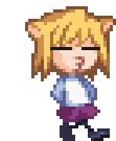

<h1 align="center">Hi there, I'm Bayori
</h1>
<h3 align="center">Chinchopa, chinchopa</h3>

  
<p\>

  <h3>My skills:</h4>
  
  
  
  
  
  <h3>My hobbies:</h4>
  <pre>
    🎮Gaming • Creating games    Minecraft, Terraria • Trainverse (In progress)
    💻Programming                Learning - Java (PaperMC API), C# (Unity), SQL
    ⚡ Fun fact:                 Buranyaaa
  </pre>

  
<p\>
