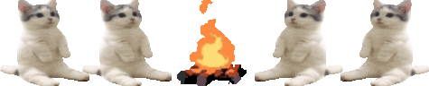

<h1 align="center">Hi there, I'm Bayori
</h1>
<h3 align="center">Chinchopa, chinchopa</h3>

  
<p\>

  <h3>My skills:</h4>
  
  
  
  
  <h3>My hobbies:</h4>
  <pre>
    🎮Gaming • Creating games    Minecraft, Terraria • Echo In The Void (In progress)
    💻Programming                Favourite Programming Language - C#
    ⚡ Fun fact:                 Buranyaaa
  </pre>

  
<p\>

<!--
**TotallyNotAinaz/TotallyNotAinaz** is a ✨ _special_ ✨ repository because its `README.md` (this file) appears on your GitHub profile.

Here are some ideas to get you started:

- 🔭 I’m currently working on ...
- 🌱 I’m currently learning ...
- 👯 I’m looking to collaborate on ...
- 🤔 I’m looking for help with ...
- 💬 Ask me about ...
- 📫 How to reach me: ...
- 😄 Pronouns: ...
- ⚡ Fun fact: ...
-->
